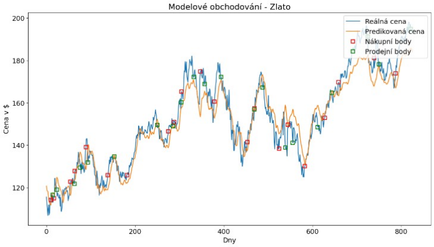

# Predikce finančních trhů pomocí GAN modelů

Tento projekt se zabývá **využitím generativních adversariálních sítí (GAN)** pro predikce vývoje na finančních trzích.  
Cílem bylo otestovat schopnost těchto modelů generovat realistické časové řady, které odpovídají historickým datům, a následně je využít pro predikci budoucího trendu cen akcií a indexů.

---

## Stručný popis projektu

Projekt zahrnuje:
- **Shromažďování a předzpracování finančních dat** (časové řady akcií, indexů, kryptoměn aj.)
- **Návrh a implementaci GAN architektury** (Generator + Discriminator)
- **Trénování modelu** na historických datech
- **Vyhodnocení predikčních schopností** a srovnání s tradičními přístupy (např. LSTM, ARIMA)
- **Analýzu výsledků** pomocí vizualizací a metrik

---

## Použité technologie

- Python (NumPy, Pandas, Matplotlib, PyTorch)
- Jupyter Notebook
- Scikit-learn
- Matplotlib / Plotly pro vizualizace

---

## Výsledky a grafy

Níže je ukázka jednoho z výstupů modelu. Přesněji se jedná o akcie Apple.

| Graf | Popis |
|------|--------|
|  | Porovnání generovaných dat akcie Apple s reálnými hodnotami. |

---

## Podrobný text práce

Podrobný rozbor metodologie, architektury modelu a vyhodnocení výsledků naleznete v přiložené textové práci:

[**Text práce (PDF)**](./graphs_text/Jezek_Pavel_vyzkumny_ukol.pdf)

